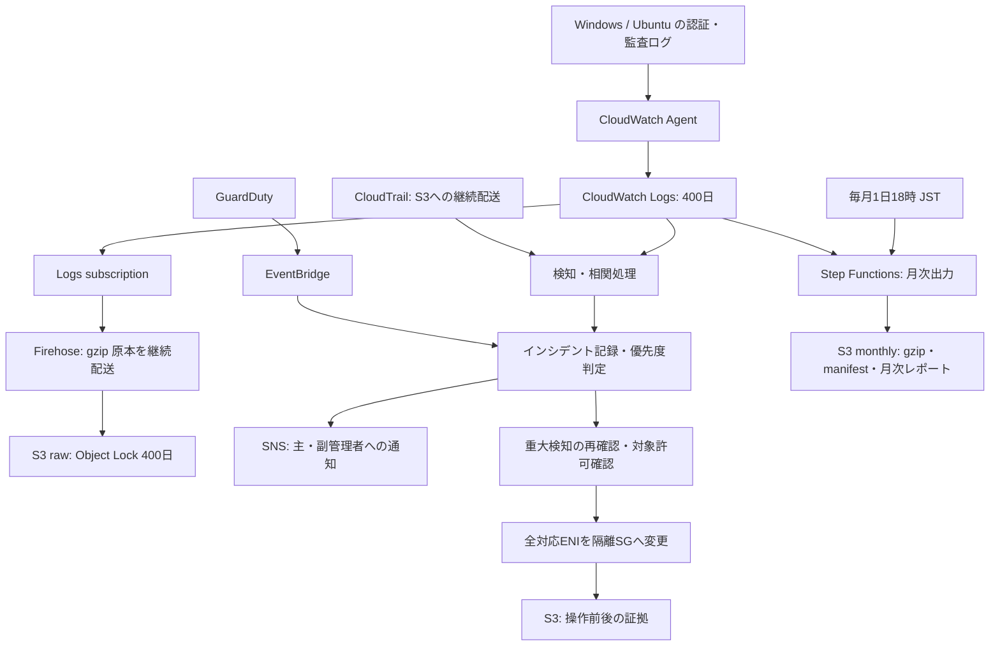

# 1年以上のログ保管・緊急通知・自動隔離の設計

状態: 設計案。v0.1.0 の機能として稼働しているものではありません。AWS リソース、通知先、スケジュール、自動隔離処理は未作成です。

ユーザー指定: 最低1年保管、毎月1日に圧縮して S3 出力、日本時間（Asia/Tokyo）、重大な検知は自動隔離、それ以外は通知。設定値の案は config/security-operations-policy.example.json に保存します。このファイルは現行スクリプトに読み込まれません。

## 採用する構成



CloudWatch を検索・検知用、S3 を長期保管・改変耐性用として使います。OS時刻は時刻同期で管理し、発生日時と受信日時を区別します。月次出力に加え、subscription と Firehose で新しいログを継続保管します。AWS も継続アーカイブには定期 export より subscription を推奨しています。[AWS: S3 export](https://docs.aws.amazon.com/AmazonCloudWatch/latest/logs/S3Export.html)

Firehose は CloudWatch subscription の圧縮済みペイロードを維持し、配送側の再圧縮は無効にする案です。原本に logGroup・logStream・event ID・timestamp・message を残し、連結 gzip メンバーを扱える読取処理を実装します。本文だけ抽出して出所を失う設定にしません。別案として Firehose の解凍後に GZIP 出力する場合は二重圧縮とメタデータ保持を実機確認します。[AWS: subscription filters](https://docs.aws.amazon.com/AmazonCloudWatch/latest/logs/SubscriptionFilters.html)

## 保存対象・期間

| 対象 | 内容 | 保存先・保持 |
| --- | --- | --- |
| Windows Security | 4624/4625、4672、4720/4726、4732等、4719、1102 | CloudWatch 400日、S3継続原本と月次出力 |
| Windows System / PowerShell | サービス・システム異常、4104、関連イベント | 同上 |
| Windows Firewall | 許可・拒否通信、日時・送信元・宛先 | 同上 |
| Ubuntu auth | SSH、sudo、認証成功／失敗 | 同上 |
| Ubuntu auditd | 身元・権限・SSH設定変更、追加する監査ルールの記録 | 同上 |
| 死活・配送確認 | 5分ごとの一意マーカー、Agent状態、欠落、空き容量 | CloudWatch 400日、S3 |
| AWS操作 | CloudTrail管理イベント Read/Write、関連する変更・アクセス | 正管理者のtrailからS3継続配送、必要項目をCloudWatchへ |
| GuardDuty | 検知、更新、調査・隔離判断 | S3 JSON、必要なら定期 findings exportも設定 |
| ネットワーク | 必要なENIのVPC Flow Logs（ACCEPT/REJECT） | S3またはCloudWatch経由でS3 |
| 監査・対応証拠 | 導入／日次レポート、隔離前後、承認・復旧、月次manifest | S3、原本と同じ保護 |

最低1年は「収集対象ログの発生から少なくとも1年間、中央保存された記録を読めること」とします。うるう年と遅延の余裕を含め CloudWatch を400日にします。400日は正式な retentionInDays の選択肢です。[AWS: PutRetentionPolicy](https://docs.aws.amazon.com/AmazonCloudWatchLogs/latest/APIReference/API_PutRetentionPolicy.html)

S3 はオブジェクト作成から400日間の COMPLIANCE Object Lock、バージョニング、Block Public Access、SSE-KMSを使う案です。既に短期設定で消えたログを後から復元できるものではなく、完全な1年分が揃うのは運用開始から1年後です。ローカルの容量制限は維持し、1年分をEC2のディスクだけに溜めません。通信断時にローカル上書きする前に配送を回復させる容量計画が必要です。

COMPLIANCE で保護したバージョンは保持期限を短縮できません。正管理者が容量・費用・廃止時の制約を理解して設定します。デフォルト保持だけに依存せず、各バージョンの RetainUntilDate を監査し、短い個別保持指定や削除マーカーの作成を運用ロールに許可しません。バージョンIDをmanifestに記録します。[AWS: Object Lock](https://docs.aws.amazon.com/AmazonS3/latest/userguide/object-lock.html)

ライフサイクル案は作成90日後に Glacier Flexible Retrieval へ移行し、450日後から期限切れデータを削除可能にするものです。即時検索はCloudWatch、S3の低頻度データは復元待ちを許容します。最新・旧バージョン双方の保持、Legal Hold、最短保管課金、実際の削除日を正管理者が確認します。SSE-KMSの鍵を先に無効化／削除するとログを読めないため、全保護データが不要になるまで鍵も保持します。

S3の raw / monthly / reports / incidents / cloudtrail / flowlogs を分け、リージョンごとにバケットを用意します。既存の専用ログ保管アカウントがあればそこで管理します。CloudWatchからのexport先は同一リージョンが必要です。

Ubuntu journal全部は現行Agent例で転送されていません。対象system/kernelログとaudit設定追加、Windows追加イベント等を収集一覧に定義してから有効化します。既存の日次レポートの末尾ログ・EVTX取得だけでは1年全件保存を保証できません。

## 毎月1日の出力

- 実行: 毎月1日18:00 JST。EventBridge Scheduler は cron(0 18 1 * ? *)、タイムゾーン Asia/Tokyo、柔軟な実行窓を無効。
- 対象: 前月1日00:00 JST以上、当月1日00:00 JST未満のイベント期間。
- 例: 2026-11-01の処理対象は2026-10-01 00:00 JSTから2026-11-01 00:00 JST直前。UTCでは2026-09-30 15:00から2026-10-31 15:00直前。
- 18時にする理由: export可能になるまで最大12時間程度の遅れがあるため。1日0時に前月末まで完全出力するとは約束しない。
- 毎月1日はジョブ開始日。データ量・他タスクとの競合次第で完了は翌日以降になる。完了期限の初期案は3日18時、4日18時に遅延到着分の再照合・補正版を発行。

タイムゾーン指定はSchedulerの正式機能です。[AWS: schedule types](https://docs.aws.amazon.com/scheduler/latest/UserGuide/schedule-types.html)

月次出力は CloudWatch CreateExportTask を使用し、1アカウント・1リージョンの既存ジョブと同じキューで直列に実施します。ロググループ／日単位の小さな期間に分割し、待機はStep Functions Standardで行います。Lambdaを24時間待機させません。同時active exportは1件で、exportは24時間でタイムアウトし得ます。必要なら期間をさらに分割します。[AWS: quotas](https://docs.aws.amazon.com/AmazonCloudWatch/latest/logs/cloudwatch_limits_cwl.html)、[AWS: export](https://docs.aws.amazon.com/AmazonCloudWatch/latest/logs/S3Export.html)

from / to はUTCミリ秒を使用します。内部期間は半開区間として保持し、APIの終了境界の解釈は月末の実イベントで検証します。必要なら境界を重ねて取得し、出力検証で期間を区切ります。AWSのガイドとAPI説明には時刻の表現差があるため、開始・終了±1msの受け入れ試験を必須にします。元ファイルは保全し、同じ内容の正規イベントを誤って重複排除しません。[AWS: CreateExportTask](https://docs.aws.amazon.com/AmazonCloudWatchLogs/latest/APIReference/API_CreateExportTask.html)

出力例:

```text
s3://<archive-bucket>/monthly/account=<id>/region=<region>/month=2026-10/run=<uuid>/
  windows-security/<task-id>/<AWS生成のgzipファイル>
  windows-system/...
  windows-powershell/...
  windows-firewall/...
  ubuntu-auth/...
  ubuntu-audit/...
  manifest.json
  report.html
  report.json
```

AWSのexportはgzipファイル群を生成するため、巨大な単一ZIPへ結合しません。月ごとのフォルダーとmanifestで一式を扱います。検索時は時刻順と仮定せず解析します。月次レポートは件数、対象EC2、対象期間、欠落・遅延、通知・隔離・復旧一覧を含みます。

manifestにはスキーマ版、JST/UTC期間、account/region/group、task ID、run ID、S3 key/version ID、ファイル数・サイズ・SHA256、ロック期限・暗号化、完了／部分失敗、補正版との関係を記録します。ETagをSHA256の代わりにしません。必要ならmanifestを独立したKMS署名鍵で署名します。

subscription／Firehoseの配送が止まった場合は、CloudWatchに残った対象期間を復旧ジョブでS3へ再保管します。配送の再試行には限度があるため、自然復旧だけに依存しません。必要な権限が戻らなければ未保管期間と期限を明示してエスカレーションします。

失敗・再実行の扱い:

1. DynamoDBでaccount/region/monthの実行ロックを取得。二重起動時は既存実行を参照。
2. 対象グループを事前登録の一覧から取得。作成前期間・廃止済みEC2も台帳で区別。
3. export開始前にrun/chunkの状態を保存。API呼出後に状態保存が失敗した場合はtask名・task ID照合で既存タスクを回収し、無条件に再作成しない。
4. 完了ステータスだけで成功扱いしない。各gzipを検証し、サイズ・保持・権限・月境界と対象期間の照合を実施。
5. 空ファイル／0件は証拠不足として扱い、死活マーカー・台帳と照合。初めからイベントがないことを確認できた場合だけ正常0件。
6. 権限不足はBLOCKED、失敗はFAILED、欠落はINCOMPLETE。完了通知は全必須項目の成功後のみ。
7. 前の成功出力を上書きしない。補正や再実行は新しいrun prefixへ出力し、正規版をmanifestで指定。
8. 48時間以上の遅延到着もrawに保管される。日次の遅延監査で過去月の補正を起動し、4日の補正版だけで完全性を保証したとは扱わない。

CloudTrail、Flow Logs、GuardDuty原本やレポートは、それぞれの継続保存prefixも月次manifestに参照として載せます。OS exportだけでAWS側ログも入ったと判断しません。件数照合はFirehose配送の重複をevent IDで扱い、exportにIDがない場合は完全一致の証明を主張せず欠落・差異を報告します。

## 緊急通知と検知条件

通知経路: CloudWatch Alarm／相関検知Lambda／GuardDuty EventBridge →インシデント処理→SNS。正管理者・副管理者の確認済み通知先へ同報します。メールだけで即応できなければ既存当番システムのWebhook等を別途接続します。現時点では通知先の登録や送信は行いません。

GuardDutyの基本検知・Runtime Monitoring・Malware Protectionは同じ収集範囲ではありません。採用する保護プランと対象EC2を正管理者が決め、有効化した機能のfindingだけを利用します。サービスを有効化しただけで全てのOSコマンドやマルウェアを検知できるとは扱いません。

単純な件数はmetric filter、送信元・アカウント・成功後の相関はJSON正規化と短期状態（DynamoDB）を使います。WindowsのXMLやUbuntuの文字列をそのままJSONパターンで判定しません。解析不能イベントは原文を保全し、監視の欠落として通知します。

| 判定 | 初期条件案 | 通知・自動対応 |
| --- | --- | --- |
| P1 / 自動隔離対象 | GuardDutyでC2・バックドア・マルウェア等の承認済みfinding type、severity 7以上、対象EC2と最新の検知をAPI再確認 | 緊急通知と許可済みEC2の自動隔離 |
| P1 / 要確認 | ログ消去1102、監査無効化、想定外の管理者追加、CloudTrail停止 | 即時通知。OSログ単独での隔離はせず、信頼できる重大検知との相関で上段へ昇格 |
| P2 | 同一送信元／同一ユーザーで5分に10回失敗、失敗後10分以内の成功、想定外の特権ログオン | 高優先度通知・調査。正当な管理者の接続失敗だけで隔離しない |
| P2 | 5分ごとの死活マーカーが15分来ない、audit lost > 0、監査サービス停止、Firehose／subscriptionの配送エラー | 通知・配送復旧。停止予定・対象廃止を台帳で考慮 |
| P2 | 空き容量10%未満が10分、月次ジョブ失敗／期限超過、S3保護や400日保持からの逸脱、KMS鍵停止・削除予約 | 通知と正管理者への是正依頼 |
| P3 | 単発のログオン失敗、一般的なスキャン、非重大なGuardDuty finding | 通常通知または日次集計 |

閾値は初期案です。severityだけで自動隔離せず、公式finding typeの具体的allowlistを正管理者が確定してから起動します。ログが来ないことと侵害は同一視しません。監視対象外のグループや過去の再配信も除外します。

P1は受付から5分以内の通知・初動を運用目標とします。検知サービス自身の遅延もあるため、攻撃発生から5分の保証ではありません。同一findingは5分単位で通知をまとめ、更新・対応失敗は別通知。担当の確認記録が15分なければ再通知、30分で正管理者へエスカレーション。SNS購読確認・配送失敗監視と、通常の通知経路と別の死活確認を用意します。

通知内容はincident ID、account/region/instance、根拠・時刻、優先度、実行結果（未実行／隔離／部分失敗／権限不足）、復旧担当と証拠リンク。パスワード・コマンド全文・個人情報を本文に流さず、認証された閲覧画面へのリンクを使用します。

## 自動隔離

対象EC2のOSへ隔離権限を渡さず、別の対応ロールで実施します。AWSから受けたfindingをGuardDuty GetFindingsで再取得し、所有アカウント、リージョン、EC2、最終検知時刻（初期案30分以内）、type・severity・アーカイブ状態を検証します。OSが送ったinstance IDや文字列だけを信用しません。

対象は正管理者が台帳と保護されたタグ SecurityResponse=auto-isolate で事前許可したEC2です。対象EC2自身・副管理者の通常運用ロールにこのタグの編集を許可しません。ログ基盤、SSM基盤、共有DB、業務停止の許可がないEC2は初期除外。Auto Scaling・ECS・共有／サービス管理ENIは専用対応を設計してから対象にします。

処理:

1. incident単位とinstance単位でロック。保守例外の理由・承認者・期限を確認。
2. 全ENI、元のSG集合、インスタンス状態、関連台帳・finding、操作者と時刻をS3／DynamoDBへ保存。保存不能なら変更せずP1通知。
3. VPCごとの事前作成された隔離SGを検証。対応できないENIがあれば先に停止して通知。
4. 各対応ENIのSGを隔離SGだけへ置換。追加だけだと元SGの許可が残るので元SGを外す。共有SGのルール自体を編集／削除しない。
5. describeで全ENIの状態を再確認。途中失敗はPARTIALとして即通知。途中成功を勝手に元へ戻し、脅威へ再接続させない。
6. 元設定・新設定・API結果を証拠に保存し、対応済み／未完了を通知。

隔離SGは業務のinboundと一般Internet outboundを許可しません。復旧用SSMとログ配送に必要な専用VPC endpointへの443等だけを事前設計します。これにより新規の業務通信・外向き通信を制限します。SGで制御できないAmazon提供DNS／メタデータ等と、管理経路が残るため、完全な無通信とは表現しません。

**既存の追跡済み通信はSG交換で切れない場合があります。** 既存接続の遮断が必要なら、正管理者が承認した追加手順（対象専用NACL／Network Firewall／EDR等）を使います。共有サブネットのNACL変更を標準の自動操作にしません。OS側のSSMコマンドは侵害されたOSで失敗する可能性があるため、成功を必ず検証します。[AWS: EC2 remediation](https://docs.aws.amazon.com/guardduty/latest/ug/compromised-ec2.html)

C2継続等でネットワーク隔離を確認できない場合に停止へ進めるオプションは、別の事前承認タグ／台帳とStopInstances権限があるEC2だけに設けます。初期案では自動停止を無効にし、直ちにP1エスカレーションします。停止はメモリ証拠やinstance storeを失う場合があるため、ネットワーク隔離と同じ操作にしません。自動削除・自動terminateは行いません。

復旧は人の承認後に実施します。根拠の調査・再構築／認証情報対応が済んでから、現状が保存済み隔離状態と一致することを確認して元のSG集合へ戻します。別管理者の変更があれば停止。30分経過などのタイマーで自動解除しません。権限不足なら手順と元のSG情報を正管理者へ渡します。

## 正管理者と副管理者の分担

| 役割 | 主な権限・責任 | 与えない権限 |
| --- | --- | --- |
| 正管理者 | 保管先・KMS・保持・既存ロール・SNS購読・Scheduler・隔離SG・対象台帳・GuardDutyを準備 | 組織の既存規則に従う |
| EC2送信ロール | 対象ログへのCreateLogStream / PutLogEventsと必要なDescribe、最小SSM権限 | EC2隔離、保管データ削除、保持変更、IAM管理 |
| 副管理者通常運用 | 読み取り監査、台帳閲覧、許可された実行・調査、運用証拠保存 | IAM削除・ログ削除・保持短縮・自動対応対象の変更を要求しない |
| 継続配送ロール | Logs subscription → Firehose、Firehose →指定raw prefix / KMS | 管理用prefix、隔離、ログ削除 |
| 月次実行ロール | logs:CreateExportTask / DescribeExportTasks、対象S3への必要なアクセス、manifest書込、DynamoDB実行状態、通知 | ロググループ削除、保持短縮、IAM管理、SG操作 |
| 検証ロール | S3 GetObjectVersion / 保護情報、kms:Decrypt、必要なら署名 | 保持解除・削除 |
| 対応ロール | GuardDuty GetFindings、EC2 Describe、許可対象ENIのModifyNetworkInterfaceAttribute、証拠書込・通知 | SGルール全体の変更／削除、IAM削除、対象外EC2操作 |
| 復旧ロール | 人の承認後の同じENI操作・証拠保存 | 未承認での解除、証拠削除 |

各APIのresource-level対応・条件キーは実装時に検証します。Describe等でResource *が必要でも、更新権限まで *にしません。副管理者にSG変更権限がなくても、正管理者が用意した対応ロールが実行できます。そのロールも権限不足ならISOLATION_BLOCKEDとして緊急通知し、成功扱いしません。

S3へのexportにはLogsサービスプリンシパルのbucket policy、SourceAccount / SourceArn制限、同一リージョン、必要なKMS key policyを正管理者が設定します。Firehose／CloudTrailのサービス経路も個別に確認します。SSE-KMSを使い、DSSE-KMSはCloudWatch export先に使いません。

IAMを作成できるだけでは、ロールの引受け、PassRole、Scheduler起動、S3書込、隔離、復旧まで可能とは判断できません。既存ロールを原則使い、作成が必要なら境界・信頼ポリシー・所有者・廃止担当を決めます。IAM削除権限がなくても運用可能な構成です。

## 受け入れ・運用・費用

導入前に正管理者が指定するもの: account/region/EC2台帳、VPCとendpoint、既存ロールARN、S3/KMS、GuardDutyとfinding allowlist、隔離SG、主副の通知先、当番の確認経路。実際の値が揃うまではAWSを変更しません。

受け入れ試験:

- 全対象ログと一意マーカーがCloudWatch／S3 rawへ届くこと。配送重複・解析不能・通信断・復旧後の遅延を確認。
- CloudWatch400日、各S3バージョン400日、公開拒否、暗号化、KMS寿命、短期上書き／削除の拒否を確認。
- うるう年、12月→1月、月末の±1ms、JST→UTC、再実行、0件、部分失敗、24hタイムアウト、権限不足の月次出力を確認。
- gz展開、連結gzip、原本と月次の件数・期間・対象群、manifest SHA256、遅延補正版を確認。
- SNS購読・実配送・再通知・担当確認・通知経路故障、死活欠落を確認。
- 検証EC2だけで重大検知→通知→全ENI隔離、権限不足、部分失敗、重複イベント、古いfinding、保守例外、除外対象を確認。
- 既存通信が残る試験、管理・ログ経路の保持、復旧承認と競合停止を確認。

費用はEC2台数だけでは算定できません。1日あたりの生ログ量、圧縮率、CloudWatch400日、S3原本＋月次の二重保管、Firehose、KMS、GuardDuty、Flow Logs、月次検証の読取とGlacier復元を見積もります。特にWindows Firewall許可ログとPowerShell全文は量が増えるため、検証期間の実測で閾値・容量を決めます。圧縮はCloudWatch保管料を直接減らす設定ではありません。

実装は、収集・保管と配送監査 → 通知・死活 → 月次出力 → 検証環境の自動隔離 → 許可済み本番EC2へ展開、の順です。復元時は新規収集・ジョブ・通知・対応の停止と元の設定への復帰を行い、ロック済みS3ログ／KMS／必要な読取経路を保持します。過去ログとIAMの削除を復元条件にしません。

現行v0.1.0のAWS監査は「retentionが設定されているか」の確認までです。次の実装では400日以上か、S3ロック期限・月次完了・通知経路・隔離準備まで検証する必要があります。
